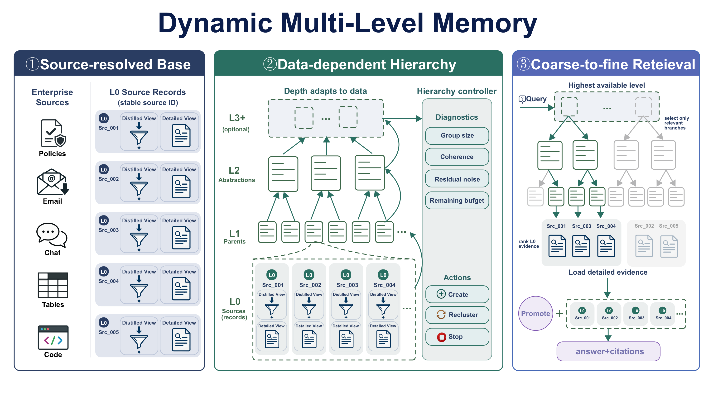
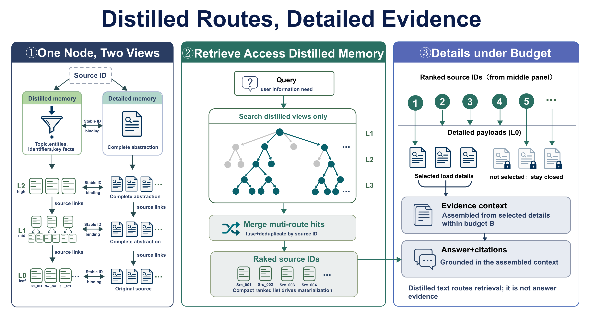
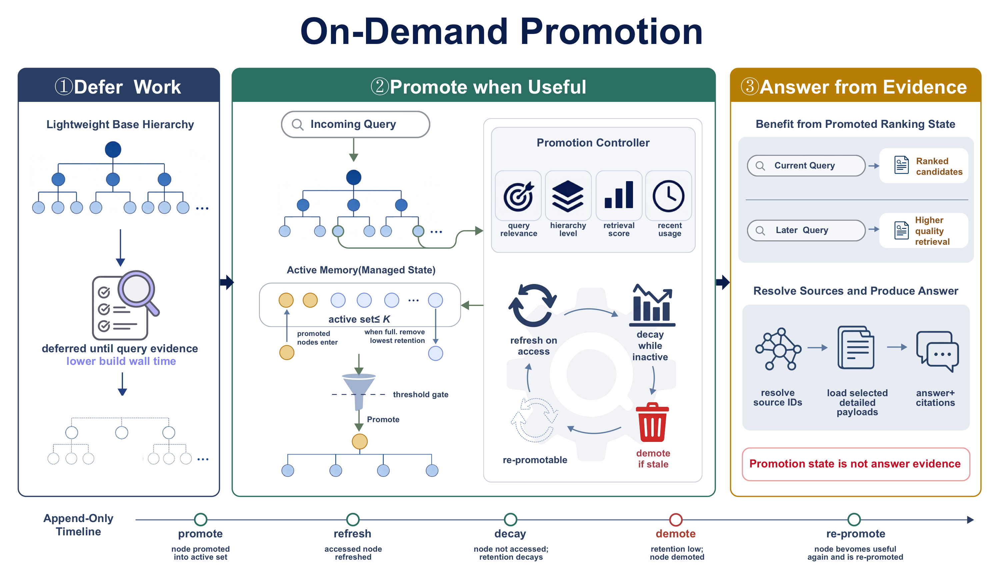

# MEMONDEMAND: A Memory Management System for Large-Scale Enterprise Data

**The first enterprise memory management system demonstrated with a billion-token context window.**

<p align="center"><strong>Developed by <a href="https://github.com/Hik289">Xinyuan Song</a> from <a href="https://cielara.ai">Cielara AI</a></strong></p>

<p align="center">
  <a href="https://cielara.ai"></a>
  <a href="https://huggingface.co/datasets/xsong69/enterpriseRAG-extension"></a>
  <a href="https://arxiv.org/abs/2608.22141"></a>
  <a href="LICENSE"></a>
  <a href="pyproject.toml"></a>
</p>

Enterprise repositories combine policies, contracts, email, tables, tickets, code, and
records whose formats, authority, and update patterns differ. Large similarity indexes
make this candidate space searchable, but do not decide how records should be organized,
represented, loaded for answering, or maintained across queries.

To our knowledge, MemOnDemand is the first enterprise memory management system evaluated
with a billion-token context window. It scales persistent memory to 1.14B tokens while
keeping the answer-time evidence context bounded.

MemOnDemand is a Cielara AI Python package and CLI that addresses these problems with
three coordinated mechanisms: a collection-dependent multi-level hierarchy, dual
distilled and detailed memory at every level, and on-demand promotion under a bounded
active-state budget. Compact records route each query; selected source-resolved details
support the answer; observed use updates which nodes remain easy to reuse.

<p align="center">
  
</p>

## What MemOnDemand Provides

| Area | Production behavior |
| --- | --- |
| Retrieval control | Direct L0 retrieval, hierarchy navigation over distilled memory, and explicit promotion. |
| Context efficiency | Compact `distilled_text` for breadth plus selected `detailed_text` for grounding. |
| Observability | Token accounting, promotion events, model aliases, answer files, and resumable run directories. |
| Evaluation | Answer quality, citation quality, retrieval-only, and ROUGE evaluation entry points. |
| Provider flexibility | Provider-neutral chat and embedding gateways. |
| Data hygiene | Local manifests and generated outputs stay outside Git by default. |

## Deployment Modes

| Mode | Owner | Typical use |
| --- | --- | --- |
| Local package | Applied ML engineer | Build and inspect retrieval runs on a workstation. |
| Batch worker | Platform team | Schedule hierarchy builds, benchmark runs, and regression jobs. |
| Service integration | Product team | Embed the package inside an internal RAG service. |
| Evaluation gate | Release team | Compare retrieval quality, citation quality, and token budget before rollout. |

## System Design

MemOnDemand separates the retrieval system into three layers:

| Layer | Responsibility | Key modules |
| --- | --- | --- |
| Data plane | Build L0 evidence, hierarchy nodes, and dual memory fields. | `memondemand.data`, `memondemand.methods.dual_node` |
| Retrieval plane | Search distilled views, navigate, promote, resolve details, and assemble answer context. | `memondemand.methods`, `memondemand.runners` |
| Operations plane | Load runtime settings, track tokens, run evaluations, and verify environments. | `memondemand.core`, `memondemand.eval`, `memondemand.cli` |

The runtime path is intentionally coarse-to-fine:

1. Retrieve global L0 candidates and high-level hierarchy candidates.
2. Navigate only the branches relevant to the query.
3. Update ranking and bounded cross-query state through on-demand promotion.
4. Resolve selected nodes to detailed source evidence under answer budget `B`.
5. Produce cited answers, token records, and evaluation artifacts.

Promotion changes which nodes remain easy to reuse across queries; it does not turn
distilled routing text into answer evidence or bypass the detailed-evidence budget.

## Data

The 1.14B-token collection used in the paper is available on Hugging Face:
[EnterpriseRAG Extension for MemOnDemand](https://huggingface.co/datasets/xsong69/enterpriseRAG-extension).
It combines the unchanged 618M-token EnterpriseRAG-Bench collection with the
353,158-document MemOnDemand extension.

## Install

```bash
git clone git@github.com:xfab-xinyuansong/MemOnDemand.git
cd MemOnDemand

python -m venv .venv
source .venv/bin/activate
pip install -e ".[all]"
```

For smaller environments:

```bash
pip install -e .              # core CLI and retrieval dependencies
pip install -e ".[local]"     # local sentence-transformer embeddings
pip install -e ".[llm,eval]"  # model providers and evaluation tools
```

Verify the package:

```bash
memondemand doctor
```

## Quick Start

Create a small local dataset:

```bash
python examples/create_demo_dataset.py
```

Build a dry-run hierarchy:

```bash
memondemand build-hierarchy \
  --tier demo \
  --l0_parquet examples/demo/manifests/l0_nodes.parquet \
  --out_dir examples/demo/results/hierarchy \
  --dry_run
```

Run a smoke retrieval job:

```bash
export MEMONDEMAND_EMBED_BACKEND=minilm
export MEMONDEMAND_L0_RETRIEVAL=bm25
export MEMONDEMAND_SKIP_L0_EMBED=1
export MEMONDEMAND_ANSWER_MODE=detailed_truncated

memondemand run \
  --method V5 \
  --hierarchy examples/demo/results/hierarchy/hierarchy.json \
  --queries examples/demo/manifests/queries.parquet \
  --out examples/demo/results/runs/V5 \
  --n_smoke 5 \
  --resume
```

Evaluate generated answers when a gold file is available:

```bash
memondemand evaluate \
  --answers examples/demo/results/runs/V5/answers.jsonl \
  --gold examples/demo/manifests/gold.jsonl \
  --out examples/demo/results/runs/V5/eval \
  --resume
```

`memondemand evaluate` calls the project evaluator in
[`memondemand/eval/evaluate_v5.py`](memondemand/eval/evaluate_v5.py). Set
`MEMONDEMAND_API_MODEL=gpt-5.4` to use the reported judge configuration; per-question and
aggregate evaluation files are written to the directory passed through `--out`.

## Production Workflow

| Step | Command or artifact | Operational note |
| --- | --- | --- |
| Prepare manifests | `manifests/l0_nodes.parquet`, `queries.parquet`, `gold.jsonl` | Keep private data outside Git. |
| Build hierarchy | `memondemand build-hierarchy` | Store hierarchy outputs under `results/hierarchy/`. |
| Run retrieval | `memondemand run` or `memondemand run-v6` | Use `--resume` for long jobs. |
| Evaluate | `memondemand evaluate`, `memondemand eval-retrieval`, `memondemand eval-rouge` | Keep raw answers and reports as local artifacts. |
| Inspect operations | Token ledger, promotion state, answer JSONL, logs | Track model alias, seed, tier, and git commit. |

For deployment patterns and system boundaries, see
[Integration guide](docs/integration.md), [Observability](docs/observability.md),
and [Production checklist](docs/production.md).

## Three Core Mechanisms

### 1. Dynamic Multi-Level Hierarchy

Enterprise collections differ across domains, tenants, and update patterns, so one fixed
taxonomy cannot fit every repository. MemOnDemand anchors L0 records to stable source
IDs and lets the collection determine both the abstraction structure and its depth.
Retrieval can follow relevant upper-level branches without losing direct access to exact
L0 sources when an abstraction omits answer-critical detail.

### 2. Detailed and Distilled Memory

<p align="center">
  
</p>

Detailed memory preserves source-specific content but is expensive to search and load;
distilled memory is cheaper to route over but can omit answer-critical detail. Every
node therefore stores both representations under the same source identity. Distilled
views drive hierarchy navigation and ranking, while only selected detailed L0 payloads
that fit answer budget `B` enter the evidence used for generation and citation.

### 3. On-Demand Promotion

<p align="center">
  
</p>

Eagerly preparing every representation wastes build time and storage on records that may
never be used. MemOnDemand promotes a node only after query evidence shows its value,
refreshes repeatedly accessed nodes, and demotes stale or low-value nodes under a bounded
active-state budget. Promotion changes cross-query priority; it does not bypass source
validation or the separate detailed-evidence budget.


## Repository Layout

```text
memondemand/
  core/       provider adapter, environment loading, config templates
  data/       hierarchy construction and data preparation
  methods/    node schema, indexes, promotion, decay, token ledger
  runners/    retrieval and answer-generation pipelines
  eval/       answer, citation, retrieval, and ROUGE evaluation
assets/      README and documentation figures
docs/        architecture, quickstart, integration, observability, operations
examples/    demo dataset generator
tests/       package and CLI smoke tests
```

## Documentation

- [Architecture](docs/architecture.md)
- [Quickstart](docs/quickstart.md)
- [Integration guide](docs/integration.md)
- [Observability](docs/observability.md)
- [Production checklist](docs/production.md)
- [Release process](docs/release.md)
- [Examples](examples/README.md)
- [Support](SUPPORT.md)

## Development

```bash
pip install -e ".[dev]"
python -m compileall -q memondemand
pytest
python -m build
```

Optional convenience commands:

```bash
make install-dev
make test
make build
```

Before pushing public changes:

```bash
rg -n --hidden -S "(sk-[A-Za-z0-9]|AKIA[0-9A-Z]{16}|BEGIN (RSA|OPENSSH|PRIVATE)|Bearer [A-Za-z0-9._+/=-]{20,})" .
rg -n "LOCAL_PATH|PRIVATE_PATH|REPLACE_ME" .
```

## Citation

[Paper](https://arxiv.org/abs/2608.22141) · [PDF](https://arxiv.org/pdf/2608.22141)

```bibtex
@misc{song2026memondemand,
  title         = {{MEMONDEMAND}: A Memory Management System for Large-Scale Enterprise Data},
  author        = {Xinyuan Song and Bowen Zhu and Hasibul Haque and Liang Zhao},
  year          = {2026},
  eprint        = {2608.22141},
  archivePrefix = {arXiv},
  primaryClass  = {cs.AI},
  doi           = {10.48550/arXiv.2608.22141},
  url           = {https://arxiv.org/abs/2608.22141}
}
```

## License

MIT. See [LICENSE](LICENSE).
